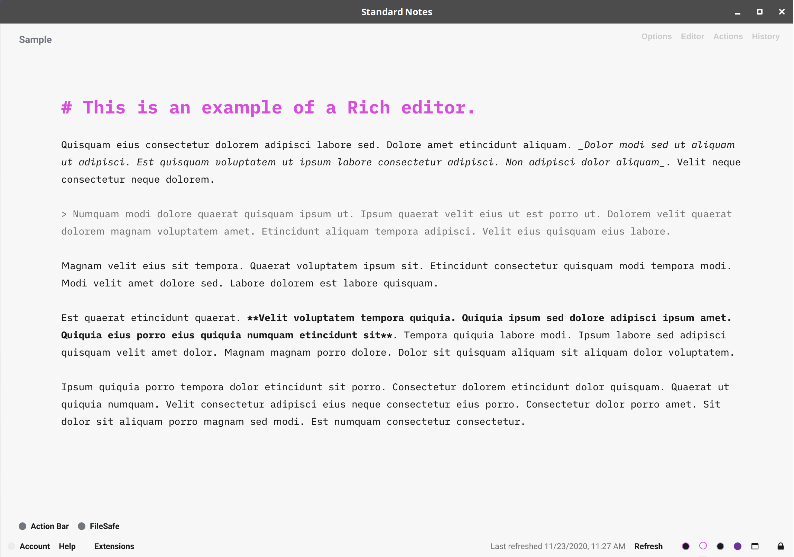
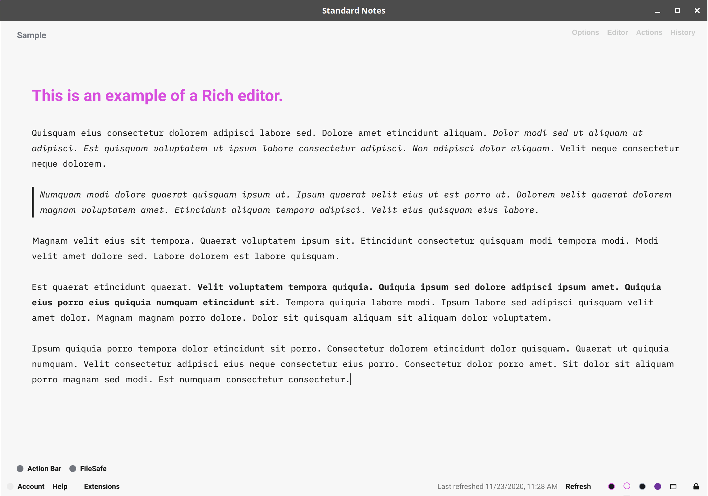

# One Light Lighter theme for Standard Notes

Theme for [Standard Notes](https://standardnotes.org/). Based on the excellent [One Dark Darker](https://github.com/eenpadvinder/standardnotes-theme-one-darker) and taking cues from iA Writer.

Note: I've created this for personal use with the Markdown Minimist editor on Linux. It's also been adapted to look nice with the 0.11.0 release of the [Rich Markdown Editor](https://github.com/arturolinares/sn-rme).

I can't guarantee it looks nice on any platform or editor. If you want some platform specific tweaks, shoot an issue.

The theme uses [iA Writer Duo](https://github.com/iaolo/iA-Fonts/) font (as shown in the preview).

## Installation

Open "Extensions" in Standard Notes and click "Import Extension". Enter the following URL as Extension Link and press Enter:

```
https://listed.to/p/m0zMIUhElM
```

## Preview


<br>

